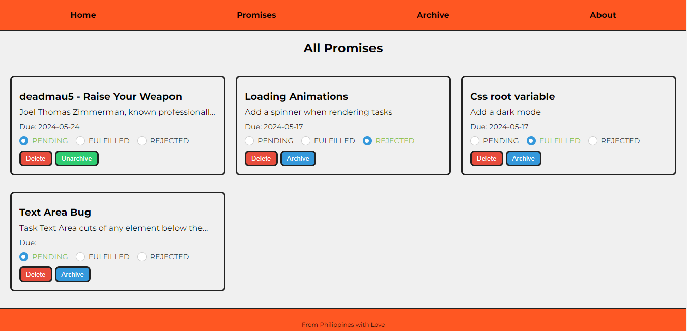
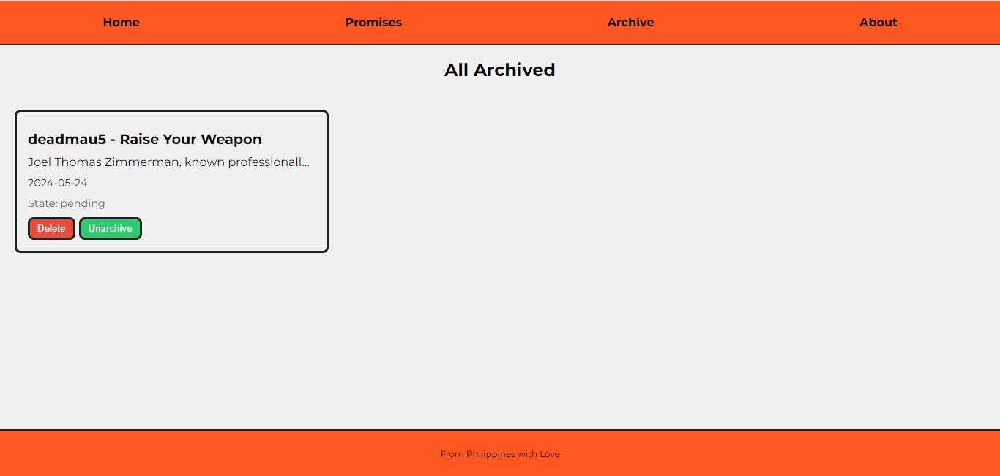

# To Do List Website with LocalStorage and JavaScript Promises

## Project Overview

This project is a simple To Do List web application that utilizes the localStorage Web API to manage tasks persistently on the client side. It is built with HTML, CSS, and JavaScript and leverages JavaScript Promises to handle asynchronous operations.

## Features

- **Create Tasks**: Users can create new tasks.
- **Categorize Tasks**: Tasks are categorized into Pending, Fulfilled, and Rejected states.
- **Update Task Status**: Users can change the status of a task to Pending, Fulfilled, or Rejected.
- **Delete Tasks**: Users can delete tasks.
- **Archive Tasks**: Users can archive tasks to keep the interface uncluttered.
- **Persistent Storage**: Tasks are stored in the browser's localStorage, ensuring data persistence across sessions.

## Screenshots

